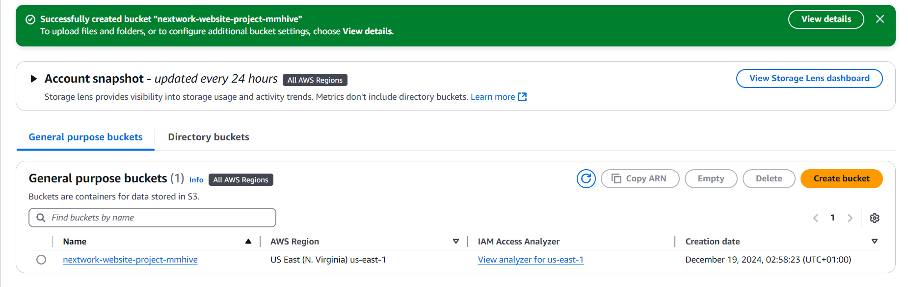
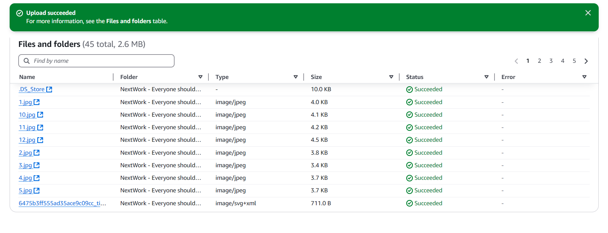
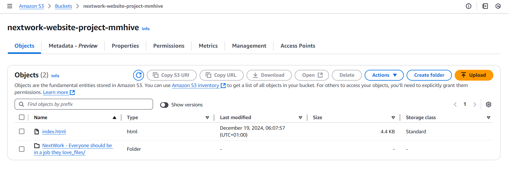
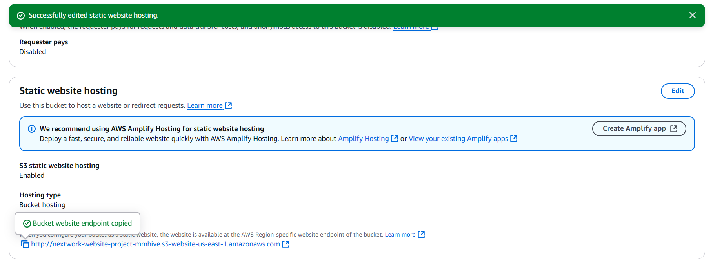
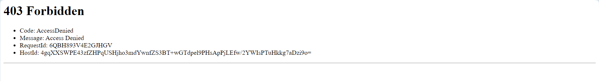
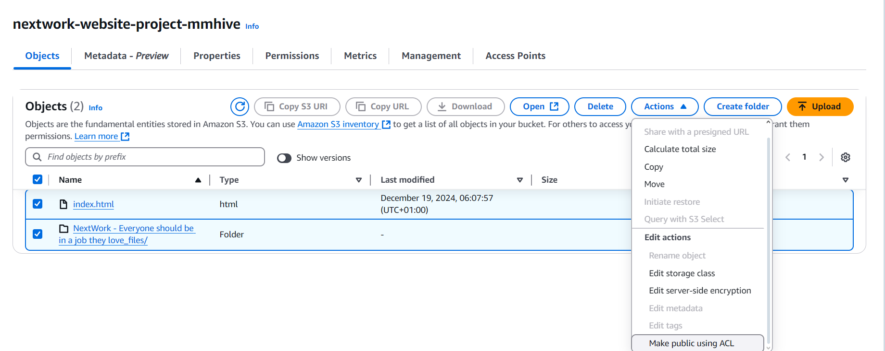
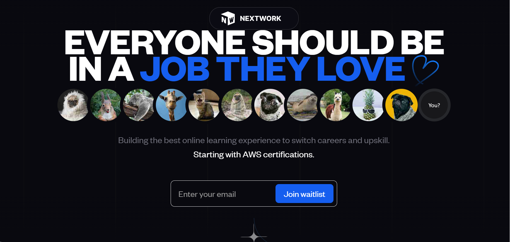

<h1>Hosting a website on s3</h1>

<h2>Description</h2>
 s3(simple storage service)is an object base storage service that can be use to store files&folders to perform mutiple task with does stored object either hosting a static website or uploading a dataset 
 for Quickinsight.
 we use s3 for storing the static website file and folder and allowing it to go
 public to the wider internet.
 
<h1>what are we achieving from this Project</h1> 
 <b>This project provides a practical understanding of AWS S3 by showcasing how to set up and configure buckets for static website hosting, including managing permissions for public access. It demonstrates a cost-efficient hosting solution using AWS's pay-as-you-go model, ideal for small projects and startups. With S3's global infrastructure, the website benefits from high availability and scalability, ensuring reliability under varying traffic loads. The project offers real-world implementation of cloud technologies, enhancing valuable AWS skills and exploring integrations like CloudFront and Route 53. It highlights quick deployment capabilities, making the website accessible worldwide with minimal effort. Additionally, it establishes a foundation for future enhancements, such as enabling HTTPS or adding dynamic features.
 </b>
<h2>Mistakes i Encountered During the project</h2>
<ul>
  <li>Incorrect Bucket Policies: Missing or misconfigured bucket policies can prevent public access to website files.</li>
  <li>Public Access Block Enabled: Forgetting to disable "Block all public access" makes the website inaccessible.</li>
  <li>Misconfigured Index Document: Specifying an incorrect index file results in the homepage not loading.</li>
  <li>File Path Errors: Uploading files with wrong paths or structures leads to broken links and missing assets.</li>
  <li>HTTPS and Domain Issues: Not configuring HTTPS for custom domains can cause security warnings for users.</li>
  
</ul>

<h2>Languages and Utilities Used</h2>

- <b>AWS CONSOLE</b> 
- <b>s3</b>

<h2>Environments Used </h2>

- <b>Windows 11</b> (21H2)

<h2>Program walk-through:</h2>

<p align="center">
Creat an s3 bucket where the file will be upload: <br/>
 
<br />
 
<br />
 Upload project files & folder of the website into S3:  <br/>

<br />
<br />
The below image show the sucessful upload of file&folder:  <br/>

<br />

<br />
 Navigate to the property setting  and configure the bucket that enable static website hosting:  <br/>

<br />

<br />
 After that copy the static website url and paste into your browser you will recieve an "403 Error" <br/>

<br />

<br />
  To resolve this connection error, enable ACL public at the object level:  <br/>

<br />

<br />
Then re-copy the URL into your browser it should be sucessful:  <br/>

<br />

<br />
</p>

<!--
 ```diff
- text in red
+ text in green
! text in orange
# text in gray
@@ text in purple (and bold)@@
```
